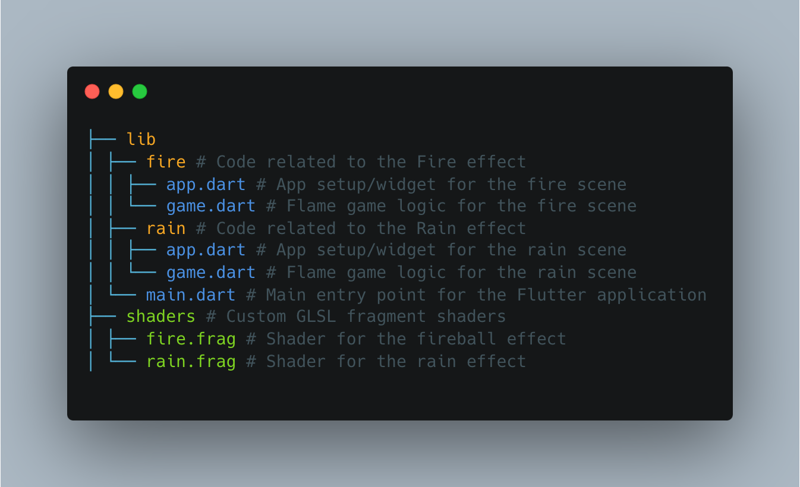

# Fire and Rain - Flutter Shader Demo

[](https://www.youtube.com/watch?v=bdy2mi7S5Nk)

---

## Overview

`fire_and_rain` is a Flutter project showcasing the power of custom fragment shaders (`.frag`) integrated with the [Flame engine](https://flame-engine.org/). This project demonstrates how to create dynamic and visually appealing effects like fireballs and rain directly on the GPU, leading to performant and intricate visuals within a Flutter application.

## Features

*   **Dynamic Fireball Effect:** Utilizes a custom `fire.frag` shader to render a stylized fire effect.
*   **Simulated Rain Effect:** Implements a `rain.frag` shader to create a falling rain visual.
*   **Flame Engine Integration:** Built upon the Flame engine for game structure, component management, and shader handling.
*   **Custom Shader Usage:** Demonstrates loading and applying GLSL fragment shaders in a Flutter/Flame environment.

## Technologies Used

*   **Flutter:** UI toolkit for building natively compiled applications for mobile, web, and desktop from a single codebase.
*   **Flame Engine:** A minimalist Flutter-based game engine providing essential tools for game development.
*   **GLSL:** OpenGL Shading Language used to write the custom fragment shaders (`.frag` files).

## Project Structure



## How it Works

The core of the visual effects lies within the `.frag` files located in the `shaders/` directory.

1.  **Shaders (`.frag`):** These files contain GLSL code that runs on the GPU for each pixel being rendered. They determine the final color of the pixel based on inputs like time (`u_time`), resolution (`u_resolution`), and texture coordinates (`v_texcoord`).
2.  **Flame Engine (`game.dart` / components):** The Flame `FlameGame` classes (`fire/game.dart`, `rain/game.dart`) manage the game loop and components. Specific components (potentially `ShaderComponent` or custom components using `Paint.shader`) are responsible for:
    *   Loading the `.frag` shader code.
    *   Compiling the shader program.
    *   Passing uniform variables (like time) to the shader on each frame.
    *   Applying the shader to a drawing operation (e.g., filling a rectangle that covers the screen or specific shapes).
3.  **Flutter (`app.dart`, `main.dart`):** Provides the main application structure and hosts the `GameWidget` from the Flame engine to display the game/shader canvas.

## Getting Started

1.  **Clone the repository:**
    ```bash
    git clone <your-repository-url>
    cd fire_and_rain
    ```
2.  **Ensure Flutter is installed:** If not, follow the [Flutter installation guide](https://flutter.dev/docs/get-started/install).
3.  **Get dependencies:**
    ```bash
    flutter pub get
    ```
4.  **Run the app:**
    ```bash
    flutter run
    ```
    Select a connected device or simulator/emulator when prompted.

## Shaders

*   **`fire.frag`:** Creates the fire effect, likely using noise functions (like Perlin or Simplex noise), mathematical shaping, and color gradients manipulated over time.
*   **`rain.frag`:** Simulates rain, possibly by generating random lines/streaks, animating their vertical position based on time, and applying perspective or blur effects.

---

Feel free to explore the code, experiment with the shaders, and learn more about using shaders in Flutter with the Flame engine!
